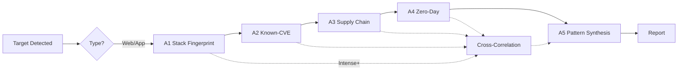
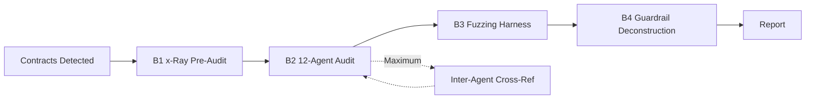

English | [简体中文](README.zh.md)

# Rogue Kali

> **Autonomous Vulnerability Discovery · Threat Emulation · Smart Contract Auditing**

An offensive security skill framework for AI agents (Claude Code, OpenClaw, Hermes Agent) with two independent analytical tracks — **Web/App Security** and **Smart Contract Auditor** — plus a full traditional penetration testing suite. Configurable **Standard / Intense / Maximum** verbosity controls analytical depth from surface scanning to guardrail-breaking critical thinking.

Built on Kali Linux with 269+ CLI tools across 14 categories. Extends the original [kali-pentest](https://github.com/x-glacier/kali-pentest) foundation with autonomous discovery engines, cross-correlation analysis, pattern synthesis, and smart contract fuzzing harness generation.

> [!WARNING]
> **Authorized Use Only** — This project is intended solely for authorized penetration testing, security research, and educational purposes. Always obtain explicit written permission before testing any target. Unauthorized access to computer systems is illegal. At Maximum verbosity, all analytical guardrails are disabled — use only on targets you own or have explicit written authorization to test.

---

## Two Independent Tracks

```
Target detected
  ├── Web/App — URL, IP, domain, API, mobile binary, git repo
  │   └── A1 Stack Fingerprint → A2 Known-CVE → A3 Supply Chain → A4 Zero-Day → A5 Report
  │
  ├── Smart Contract — .sol, Foundry, Hardhat, EVM bytecode
  │   └── B1 x-Ray Pre-Audit → B2 12-Agent Audit → B3 Fuzzing Harness → B4 Report
  │
  └── Mixed (dApp frontend + contracts) → both tracks, independent reports
```

### Track A: Web/App Autonomous Analyzer

| Phase | What It Does |
|-------|-------------|
| A1 Stack Fingerprint | Tool-assisted version detection, WAF identification, EOL checking |
| A2 Known-CVE | NVD, searchsploit, EPSS, Vulners, GitHub issues — depth-scoped by verbosity |
| A3 Supply Chain | Dependency tree analysis, OSV scanning, typosquat detection, lifecycle script audit |
| A4 Zero-Day | State machine enumeration, fuzzing blueprint generation, guardrail bypass hypothesis |
| A5 Pattern Synthesis | Recurring vuln classes, architectural anti-patterns, developer behavioral signatures |

### Track B: Smart Contract Auditor

| Phase | What It Does |
|-------|-------------|
| B1 x-Ray Pre-Audit | Contract enumeration, invariant synthesis, delta write extraction, protocol type detection |
| B2 12-Agent Audit | Math, access control, economic, execution trace, invariant, periphery, first principles, asymmetry, boundary, numerical gap, trust gap, flow gap |
| B3 Fuzzing Harness | Foundry/Medusa/Echidna property generation, contradictory invariants, negative tests |
| B4 Guardrail Deconstruction | Bypass enumeration for every security control (nonReentrant, onlyOwner, oracle, pausable) |

---

## Verbosity Levels

| Verbosity | Best For | Analytical Depth |
|---|---|---|
| **Standard** | Quick assessments, known-vuln checks | Per-phase nominal, exact matches only |
| **Intense** | Deep security reviews, bug bounty recon | Multi-pass, cross-phase correlation, compound findings |
| **Maximum** | Full-spectrum threat emulation, red team | Exhaustive attack graph, guardrail elimination, exploit synthesis |

### Cross-Correlation Engine (Intense+)

Automatically chains findings across phases into compound exploits:

```
[A4 Weak JWT secret] + [A1 nginx 1.18.0] + [A3 lodash prototype pollution]
  → "JWT bruteforceable → admin access → prototype pollution RCE"
```

### Pattern Synthesis (Intense+, Primary in Maximum)

Detects emergent patterns that transcend individual bugs:

- **Recurring vuln class**: same CWE across 3+ components → systemic failure
- **Architectural anti-pattern**: flawed design repeated in multiple modules
- **Developer behavioral signature**: consistent mistakes across codebase
- **Security theater**: controls that appear to protect but are bypassable

### Guardrail Breaking (Intense+, Maximum)

For every security control detected, generates bypass hypotheses — WAF evasion, reentrancy guard bypass, oracle manipulation, rate-limit circumvention, input validation bypass.

---

## Directory Structure

```
.
├── kali-pentest/
│   ├── SKILL.md                          ← Entry point: two-track system, verbosity engine
│   └── references/
│       ├── playbooks/
│       │   ├── web-app-autonomous.md     ← Track A: Web/App Autonomous Analyzer
│       │   ├── smart-contract-auditor.md ← Track B: Smart Contract Auditor
│       │   └── ... 16 existing playbooks (AD, web, API, cloud, wireless, ...)
│       ├── environment/                  ← Server + Docker setup guides
│       ├── information-gathering/        ← 48 tools
│       ├── vulnerability/                ← 17 tools
│       ├── web/                          ← 38 tools
│       ├── exploitation/                 ← 24 tools
│       ├── password/                     ← 21 tools
│       ├── wireless/                     ← 27 tools
│       ├── cloud-native/                 ← 8 tools
│       ├── rfid-nfc/                     ← 5 tools
│       ├── voip-ics/                     ← 8 tools
│       ├── reverse-engineering/          ← 17 tools
│       ├── forensics/                    ← 23 tools
│       ├── post-exploitation/            ← 22 tools
│       ├── sniffing-spoofing/            ← 10 tools
│       └── reporting/                    ← templates + workflow
├── kali-pentest-zh/                      ← Chinese mirror (structurally synchronized)
├── demo/                                 ← Simulation recording and report attachments
├── system-design-autonomous-analyzer.md  ← Full system design document
└── README.md                             ← This file
```

---

## Getting Started

### 1. Install the skill

```bash
cp -r kali-pentest /path/to/your/agent/skills/kali-pentest
```

| Agent | Skills path |
|---|---|
| Claude Code | `~/.claude/skills/` (personal) or `.claude/skills/` (project) |
| OpenClaw | `~/.openclaw/skills/` |
| Hermes Agent | `~/.hermes/skills/` |

### 2. Provide Kali access

Three options:

- **Local mode** — the agent runs directly on Kali: tools are invoked directly
- **Server mode** (preferred) — full Kali over SSH: no Docker networking limits
- **Docker mode** — persistent container: good for CLI scanning, web/API testing

See `kali-pentest/references/environment/` for setup guides.

### 3. Invoke

Use natural language. Specify verbosity to control depth:

```
Kali tools are available locally (this machine is Kali).
Target: https://example.com
Run a web application vulnerability assessment with --verbosity intense.
I have authorization.
```

```
Kali server: ssh -i ~/.ssh/kali_key root@192.168.1.100
Target contracts: /tmp/defi-protocol/
Run a full smart contract audit with --verbosity maximum.
```

```
Kali tools are available locally (this machine is Kali).
Slash command: /rouge-kali
```

---

## Usage Examples

### Web/App — Standard Scan

```
Kali tools are available locally (this machine is Kali).
Target: 10.0.0.0/24
Scan the target network for open ports, versions, and known CVEs, then produce a report.
I have authorization.
```

### Web/App — Intense Discovery

```
Kali tools are available locally (this machine is Kali).
Target: https://example.com
Run a deep web application assessment with dependency supply chain scan and zero-day fuzzing blueprints.
Verbosity: intense.
I have authorization.
```

### Web/App — Maximum Threat Emulation

```
Kali server: ssh -i ~/.ssh/kali_key root@192.168.1.100
Target: https://example.com
Maximum verbosity. Full-spectrum threat emulation. I want every possible attack path
enumerated, every guardrail bypassed, compound exploit chains synthesized.
Include the full attack graph and pattern analysis in the report.
I have authorization. I understand the risks.
```

### Smart Contract — Standard Audit

```
Kali tools are available locally (this machine is Kali).
Target contracts: /tmp/protocol-audit/
Run a standard smart contract audit. Identify entry points, synthesize invariants,
run the 12-agent audit, and generate a fuzzing harness.
```

### Smart Contract — Maximum Audit

```
Kali tools are available locally (this machine is Kali).
Target contracts: /tmp/protocol-audit/
Maximum verbosity. This is a DeFi lending protocol with TVL > $10M.
Upgradeable proxy pattern detected. Oracle dependency detected.
Assume every function is vulnerable. Generate contradictory invariants.
Deconstruct every guardrail. Produce a full attack graph.
```

### Mixed dApp (Both Tracks)

```
Kali tools are available locally (this machine is Kali).
Target: https://dapp.example.com
This is a dApp with a React frontend and Solidity smart contracts at /tmp/contracts/.
Run both tracks independently with intense verbosity. Produce separate reports.
```

### Traditional Pentest (Existing Playbooks)

```
Kali server: ssh -i ~/.ssh/kali_key root@192.168.1.100
First run a full port scan and service fingerprinting against 192.168.1.50,
then plan and execute an in-depth penetration test.
I have authorization.
```

---

## Workflow

### Track A Workflow



### Track B Workflow



---

## Architecture

### Document Layering

| Layer | Files | Responsibility |
|-------|-------|----------------|
| Entry point | `SKILL.md` | Global workflow, verbosity engine, two-track routing |
| Scenario workflows | `playbooks/*.md` | Phase-by-phase procedures, decision trees, stopping conditions |
| Tool selection | `<category>/README.md` | Category overview, tool comparison, selection guidance |
| Tool reference | `<category>/tools/<name>.md` | Parameters, command examples, installation |

### State Management

All state stored on the Agent host at `/tmp/rouge-kali-state/<target>/`:

```
/tmp/rouge-kali-state/<target>/
├── web/                      ← Track A state
│   ├── phaseA1_stack.json
│   ├── phaseA2_cves.json
│   ├── phaseA2_exploits.json
│   ├── phaseA3_supply_chain.json
│   ├── phaseA4_hypotheses.json
│   ├── phaseA4_blueprints.json
│   ├── analytic_graph.json   (Maximum)
│   ├── compound_findings.json
│   ├── guardrail_bypasses.json
│   ├── emergent_patterns.json
│   └── report.md
│
└── contracts/                ← Track B state
    ├── phaseB1_analysis.json
    ├── phaseB2_audit_findings.json
    ├── phaseB3_fuzz_results.json
    ├── attack_graph.json     (Maximum)
    ├── guardrail_deconstruction.json
    ├── fuzzer_logs/
    └── report.md
```

### Verbosity Auto-Detection

When no verbosity is specified, the system selects a minimum:

**Smart contract:**
- DeFi / TVL > $100K → Intense minimum
- Upgradeable proxies → Intense minimum
- Oracle/flash loan/AMM → Intense minimum
- Critical infrastructure → Maximum minimum

**Web/App:**
- E-commerce / payments → Intense minimum
- Healthcare / authorization → Intense minimum
- Previously breached → Maximum minimum

---

## Tested Models

The skill workflow has been optimized and tested with:

- `claude-opus-4.6`
- `claude-sonnet-4.6`
- `deepseek-v4-pro`
- `qwen3.6:27b` — local fallback for air-gapped environments

---

## License

MIT — see [LICENSE](LICENSE).

## Disclaimer

This project is provided as-is for educational purposes and authorized security testing. Users are solely responsible for obtaining written authorization and complying with applicable laws. The authors assume no liability.

## Contributing

Issues and pull requests are welcome.
