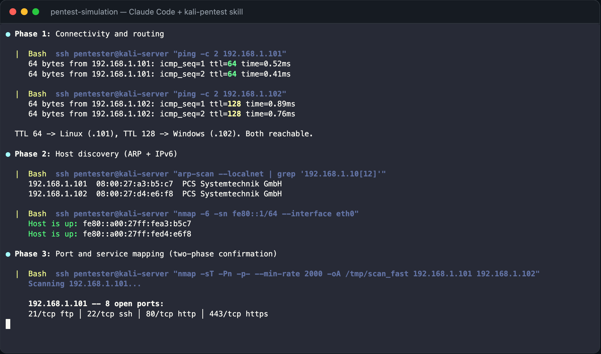
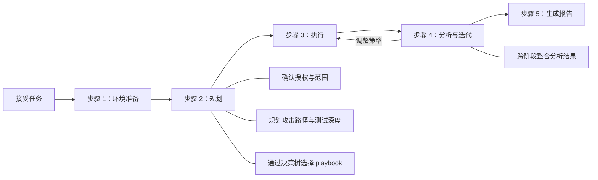
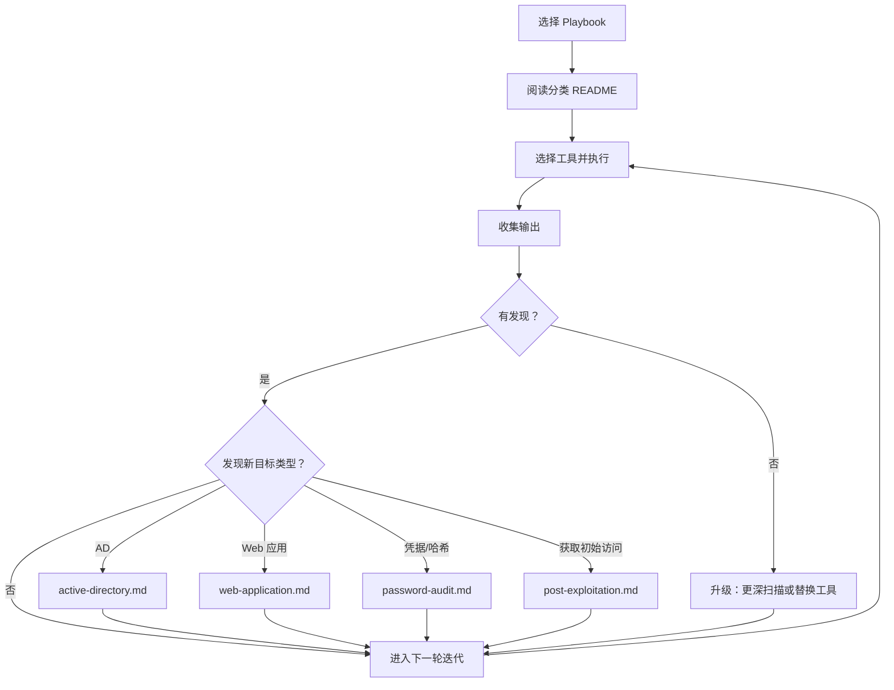

[English](README.md) | 简体中文

# kali-pentest

基于 Kali Linux 的渗透测试 Skill，适用于 Claude Code、OpenClaw、Hermes Agent 等 AI Agent。目前已收录 269 CLI 工具（涵盖 14 个分类）。内置各场景下的覆盖矩阵、零发现应对、客观停止条件等强制指令，确保渗透测试深度。

与传统的自动化渗透测试工具不同，AI Agent 通过 SSH 或 Docker 连接到 Kali 环境后，将根据任务目标自主规划攻击路径、选择工具、跨阶段整合分析结果并调整渗透策略，最后生成结构化报告 — 任务期间强制授权检查，高风险操作需人工审批。

> [!WARNING]
> **仅限授权使用** — 本项目仅用于已授权的渗透测试、安全研究和教育目的。在测试任何目标前，请务必取得明确的书面授权。未经授权访问计算机系统属违法行为。

---

## 演示

一次端到端的模拟渗透测试（使用模拟数据）。

**目标**: 192.168.1.101（Ubuntu 24 — 8 个服务）+ 192.168.1.102（Windows Server 2022 — 8 个服务）。

初始阶段 - 连通性验证、主机发现和端口扫描：


深度测试阶段 - 漏洞检测与零发现应对：


**发现的攻击链**: Redis 无认证 → SSH shell → SUID 提权 → root → 路径遍历读取 MSSQL 凭据 → xp_cmdshell → 凭据复用 → 域管理员 → secretsdump

<a href="https://x-glacier.github.io/kali-pentest/demo/player.html">
<picture>
  
</picture>
</a>

在浏览器中打开 [`demo/player.html`](https://x-glacier.github.io/kali-pentest/demo/player.html) 观看 asciinema 录屏回放。也可通过命令行播放：

```bash
# 安装 asciinema（如未安装）: pip install asciinema
asciinema play demo/pentest-simulation.cast
```

**报告附件**：
- [`demo/simulation-report.md`](https://x-glacier.github.io/kali-pentest/demo/simulation-report.md) — 完整的 Markdown 报告，含证据、复现步骤和修复建议
- [`demo/simulation-report.html`](https://x-glacier.github.io/kali-pentest/demo/simulation-report.html) — 美观的 HTML 报告（深色主题、攻击链图表、严重程度标签）

---

## 工作流

### 整体流程



### 执行细节（步骤 3）



---

## 快速开始

### 1. 安装 Skill

将 skill 目录复制到 AI Agent 的 skills 文件夹：

```bash
cp -r kali-pentest-zh /path/to/your/agent/skills/kali-pentest-zh
```

| Agent | Skills 路径 |
|---|---|
| Claude Code | `~/.claude/skills/`（个人）或 `.claude/skills/`（项目） |
| OpenClaw | `~/.openclaw/skills/` |
| Hermes Agent | `~/.hermes/skills/` |

### 2. 提供 Kali 访问

Agent 需要一个 Kali Linux 环境，三种方式：

- **本地模式**：Agent 直接运行在 Kali 系统上——工具通过 bash 直接调用，无需 SSH 或 Docker。适合 AI Agent 宿主机本身就是 Kali 的场景。  
    参考文档：[Kali 安装指南](https://www.kali.org/docs/installation/)、[本地模式指南](kali-pentest-zh/references/environment/local-mode.md)。

- **服务器模式（远程首选）**：通过 SSH 使用完整 Kali — 避免 Docker 网络、原始套接字、无线和 GPU 限制。  
    参考文档：[Kali 安装指南](https://www.kali.org/docs/installation/)、[服务器模式指南](kali-pentest-zh/references/environment/server-mode.md)。

- **Docker 模式**：预先构建持久化容器并安装工具。适合 CLI 信息收集、漏洞扫描、Web/API 与云原生测试以及报告生成。  
    参考文档：[Kali Docker 指南](https://www.kali.org/docs/containers/using-kali-docker-images/)、[Docker 模式指南](kali-pentest-zh/references/environment/docker-mode.md)。

告知 Agent 连接方式：

```
Kali 工具已在本机可用（当前系统为 Kali）。
```

或使用远程 Kali 服务器（推荐使用 SSH 密钥）：

```
Kali 服务器: ssh -i ~/.ssh/kali_key root@192.168.1.100
```

或使用本地 Docker：

```
持久化 Docker 容器 `kali-pentest` 已完成初始化，并已预装完整工具集。
```

*针对 OpenClaw 等 AI 助手，也可在 TOOLS.md 中配置 Kali 连接信息，以便 Agent 自行读取，无需每次询问。*

### 3. 调用

通过以下方式，使用自然语言下达渗透测试任务，Agent 确认范围后自主推进。

**斜杠指令**：

适用于 Claude Code 及兼容的 Agent。
```
/kali-pentest-zh
```

**对话调用**：

适用于 OpenClaw、Hermes Agent 等 AI 助手。

### 已测试模型

Skill 工作流已针对下列模型优化 & 测试：

- `claude-opus-4.6`
- `claude-sonnet-4.6`
- `deepseek-v4-pro`
- `qwen3.6:27b` — 本地备选模型，用于内网隔离环境（需设置上下文长度 ≥ 128K）

---

## 使用示例

Agent 支持三种测试深度——**Quick**（快速检查）、**Standard**（默认）、**Deep**（最大覆盖）。在任务描述中用自然语言控制：

| 提示词中的措辞 | 深度 |
|---|---|
| "快速扫描"、"快速检查" | Quick |
| *（无深度限定词）* | Standard |
| "全面评估"、"深度渗透"、"最大覆盖" | Deep |

**示例一**（Quick）— "快速扫描"：

```
Kali 工具已在本机可用（当前系统为 Kali）。
目标: 10.0.0.0/24
快速扫描目标网络的开放端口以及对应的服务/协议名称和版本，输出中文报告。
已获得授权。
```

**示例二**（Standard）— 无深度限定词：

```
持久化 Docker 容器 `kali-pentest` 已完成初始化，并已预装完整工具集。
使用 Docker 模式对 http://192.168.1.50 进行 Web 应用渗透测试，输出详细的中文报告。
已获得授权。
```

**示例三**（Deep）— "深度渗透"：

```
Kali 服务器: ssh -i ~/.ssh/kali_key root@192.168.1.100
先对 192.168.1.50 执行全端口扫描和服务识别，再根据识别结果制订方案，开展全方位的深度渗透测试，不要忽略任何可能的弱点。测试完成后输出详细的中文报告。
已获得授权。
```

> [!TIP]
> 一次完整、深入的渗透测试任务，可能需要经过多轮对话才能完成。如果 Agent 过早结束或覆盖不足，可以在对话中直接指明问题，也可以追问：
> - "执行渗透测试任务期间充分利用了 Kali Linux 工具吗？"
> - "现在的渗透测试结果足够全面和深入吗？"
> - "检查 playbook 的停止条件，是否所有检查项都已满足？"

<details>
<summary>更多示例（API、云原生、移动应用、无线、源码、VoIP/ICS）</summary>

```
目标域: corp.example.com，域控 10.0.0.5
执行 Active Directory 安全评估，覆盖枚举、Kerberoasting、ACL 滥用和证书模板检查。
```

```
目标 API: https://api.example.com，OpenAPI spec 位于 /tmp/openapi.yaml
执行 API 安全评估，覆盖认证、授权和 schema 驱动测试。
```

```
目标: Kubernetes cluster context prod-audit 和 container registry registry.example.com
执行只读云原生安全评估，输出发现报告。
```

```
目标应用: /tmp/app.apk，测试账号 user@example.com
执行 Android 应用安全评估，包括静态分析、运行时检查和后端端点映射。
```

```
授权 SSID: CorpWiFi，BSSID: AA:BB:CC:DD:EE:FF，信道 6
执行无线安全评估，包括被动发现、握手捕获、WPS 检测和 evil twin 测试。
```

```
目标仓库: /tmp/source-repo（含 Git 历史）
执行源码与依赖审计，包括密钥扫描、SAST 和 CI/CD 流水线安全检查。
```

```
目标: SIP 服务 10.10.20.15 和 Modbus 主机 10.10.30.20
保守的只读 VoIP/ICS 协议评估。不发起呼叫或写入 PLC/Modbus 寄存器值。
```

</details>

---

## 架构

### 目录结构

```
demo/                          ← 模拟录屏和报告附件
├── pentest-simulation.cast    ← asciicast v2 录屏文件
├── player.html                ← 浏览器 asciinema 播放器
├── simulation-report.md       ← 完整 Markdown 报告
└── simulation-report.html     ← 美化 HTML 报告

kali-pentest/
├── SKILL.md                   ← Agent 入口：规划、执行、错误处理
└── references/
    ├── playbooks/             ← 16 个场景工作流（AD、Web、内网、云、无线……）
    ├── environment/           ← 服务器模式和 Docker 模式配置
    ├── information-gathering/ ← 48 个工具
    ├── vulnerability/         ← 17 个工具
    ├── sniffing-spoofing/     ← 10 个工具
    ├── web/                   ← 38 个工具
    ├── exploitation/          ← 24 个工具
    ├── password/              ← 21 个工具
    ├── wireless/              ← 27 个工具
    ├── cloud-native/          ← 8 个工具
    ├── rfid-nfc/              ← 5 个工具
    ├── voip-ics/              ← 8 个工具
    ├── reverse-engineering/   ← 17 个工具
    ├── forensics/             ← 23 个工具
    ├── post-exploitation/     ← 22 个工具
    └── reporting/             ← 1 个工具 + 报告模板
```

`kali-pentest-zh/` 目录是中文镜像，与 `kali-pentest/` 保持结构同步。

### 文档分层

Skill 采用四层文档架构，每层职责明确，agent 自上而下阅读：

| 层级 | 文件 | 职责 |
|------|------|------|
| 入口 | `SKILL.md` | 全局工作流（第一步至第五步）、执行规范、通用测试原则 |
| 场景工作流 | `playbooks/*.md` | 分阶段流程、决策树、具体命令管道、深度强化指令、停止条件 |
| 工具选择 | `<category>/README.md` | 分类概览、工具对比、选择指南 |
| 工具参考 | `<category>/tools/<name>.md` | 参数说明、命令示例、安装、注意事项、官方链接 |

通用原则放在 `SKILL.md`（简短、无代码块）。场景专属实现放在 playbook（具体命令、测试矩阵、覆盖要求）。分层结构可避免重复，同时确保全局覆盖和场景深度。

### 深度强化

每个 playbook 在关键工作流决策点包含加粗标注的强制指令，防止 agent 做表面化的浅层测试：

- **覆盖要求** — 测试所有发现的目标（端点、服务、凭据），而非抽样。
- **零发现应对** — 自动化工具报告零发现时，必须升级或手动验证。
- **覆盖矩阵** — 构建显式的"项目 × 测试"矩阵，逐项完成。
- **攻击升级** — 按递进深度执行多种攻击技术。

每个 playbook 均有客观、可验证的停止条件——不是"测试已完成"，而是必须填充的特定产物、矩阵和清单。每个已确认发现必须包含可重现的完整命令及其实际输出作为证据。

### 交叉引用逻辑

Playbook 之间构成有向连通图。当某个工作流阶段发现属于其他场景的目标时（如内网扫描中发现 AD 信号、Web 测试中发现 API 端点），playbook 会指引 agent 切换到对应场景。所有此类交接均列在每个 playbook 底部的"交叉引用"部分。

可复用方法（如 `internal-network.md` 中的扫描流程和 `internal-network-protocols.md` 中的协议枚举）可被其他 playbook 引用。

### Playbooks

16 个场景工作流，包含阶段、决策树、风险门槛和停止条件：

| Playbook | 场景 |
|---|---|
| `internal-network.md` | 主机发现、端口扫描、服务枚举、跳板转发 |
| `internal-network-protocols.md` | SMB、MSRPC、SNMP、SMTP、DNS、数据库、RDP 协议专项枚举 |
| `external-attack-surface.md` | OSINT、子域枚举、暴露服务扫描 |
| `web-application.md` | OWASP Top 10、CMS、注入、认证、业务逻辑 |
| `api-security.md` | REST、GraphQL、gRPC、WebSocket、JWT、BOLA/IDOR |
| `active-directory.md` | Kerberoasting、ADCS、中继、ACL 滥用、DCSync |
| `password-audit.md` | 哈希破解、密码喷洒、凭据复用、捕获 |
| `wireless-assessment.md` | WPA/WPA3、WPS、evil twin、Bluetooth/BLE |
| `cloud-native-assessment.md` | AWS/Azure/GCP IAM、Kubernetes、容器、Serverless |
| `mobile-application.md` | Android/iOS 静态+动态分析、SSL pinning bypass |
| `post-exploitation.md` | 提权、横向移动、持久化、C2 |
| `forensics-triage.md` | 磁盘镜像、内存取证、日志分析、隐写术 |
| `rfid-nfc.md` | NFC/RFID 克隆、智能卡、固件提取 |
| `voip-ics.md` | VoIP/SIP、ICS/OT/Modbus、IPMI/BMC（安全优先） |
| `source-code-audit.md` | 密钥扫描、SAST、依赖审计、CI/CD 检查 |
| `reporting-workflow.md` | 证据打包、CVSS 评分、报告生成 |

### 工具筛选标准

所有工具均为 Agent 自主操作筛选：

- **仅限 CLI 自动化** — 排除纯 GUI 工具和交互式调试器
- **纳入 headless 二进制分析** — `strings`、`checksec`、`radare2` one-shot、Ghidra Headless
- **优先 CLI 替代方案** — 如使用 `tshark` 代替 Wireshark

---

## 免责声明

本项目仅用于教学和已授权的安全测试，不提供任何形式的担保。用户有责任自行取得书面授权并遵守适用的法律法规，作者不对因使用本项目造成的损害承担任何责任。

## 漏洞披露

在授权测试中发现的安全漏洞，必须通过约定渠道私下报告给资产所有者。在所有者获得合理修复时间之前，不得公开披露漏洞细节。请遵循[负责任披露](https://zh.wikipedia.org/wiki/%E8%B4%9F%E8%B4%A3%E4%BB%BB%E7%9A%84%E6%8A%AB%E9%9C%B2)原则及测试授权中约定的披露条款。

## 参与贡献

欢迎提交 Issue 和 Pull Request。
